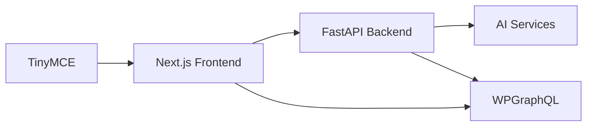

# Transcript to WP

A web application that converts YouTube transcripts into professional blog posts and publishes them directly to WordPress, powered by AI.

## Features

- **YouTube Integration**: Automatically fetch transcripts from YouTube videos
- **AI Processing**: Convert transcripts into various formats using multiple AI models:
  - GPT-4
  - Gemini
  - DeepSeek
  - Llama 3
- **Multiple Output Formats**:
  - Blog Posts
  - Step-by-Step Guides
  - Summaries
  - Educational Materials
- **WordPress Integration**:
  - Multiple account management
  - Post scheduling
  - Draft/publish control
  - Categories and tags support
  - Featured image support
- **Content Management**:
  - Template system
  - Post management interface
  - Bulk actions
  - Search and filtering

## Setup

1. Clone the repository:
```bash
git clone https://github.com/yourusername/Transcript-to-WP.git
cd Transcript-to-WP
```

2. Create and activate a virtual environment:

For Windows:
```bash
python -m venv venv
.\venv\Scripts\activate
```

For macOS/Linux:
```bash
python3 -m venv venv
source venv/bin/activate
```

3. Install Python dependencies:
```bash
pip install -r requirements.txt
```

4. Create a `.env` file in the root directory with your API keys:
```env
OPENAI_API_KEY=your_openai_key_here
GEMINI_API_KEY=your_gemini_key_here
GROQ_API_KEY=your_groq_key_here
```

5. Start the servers:
- Backend: `python server.py` (runs on port 5000)
- Frontend: `python -m http.server 8000`

6. Access the application at `http://localhost:8000`

## WordPress Setup

1. In your WordPress site:
   - Go to Users → Profile
   - Scroll to Application Passwords
   - Add new application password
   - Copy the generated password

2. In the application:
   - Click "Manage WP Accounts"
   - Add your WordPress site URL
   - Enter your username
   - Enter the application password
   - (Optional) Add to a folder for organization

## Usage

1. Enter a YouTube URL
2. Select desired format:
   - Blog Post
   - Step-by-Step Guide
   - Summary
   - Educator Plus
3. Choose AI model
4. Generate content
5. Edit as needed in the rich text editor
6. Add title, categories, tags
7. Select WordPress account
8. Publish or schedule

## Project Structure

```
Transcript-to-WP/
├── server.py           # Flask backend server
├── ai_agent.py        # AI processing logic
├── requirements.txt   # Python dependencies
├── .env              # API keys (not in repo)
└── static/           # Frontend files
    ├── index.html
    ├── wordpress_management.html
    ├── wordpress_posts.html
    ├── sent_posts.html
    └── images/
```

## Security Notes

- Never commit your `.env` file
- Use application passwords for WordPress:
  - Create new application passwords monthly for enhanced security
  - Delete old application passwords after creating new ones
  - Never share or reuse application passwords
- Store credentials securely
- Follow WordPress security best practices
- Enable two-factor authentication where possible
- Regularly check WordPress access logs for suspicious activity

## License

Copyright (c) 2024 CCwithAI

Permission is hereby granted, free of charge, to any person obtaining a copy
of this software, to use the software for personal and non-commercial purposes,
subject to the following conditions:

1. **Usage Restrictions**:
   - This software may not be redistributed without explicit permission
   - Commercial use requires prior written permission from the copyright holder
   - Modifications are allowed for personal use only

2. **No Warranty**:
   THE SOFTWARE IS PROVIDED "AS IS", WITHOUT WARRANTY OF ANY KIND, EXPRESS OR
   IMPLIED. IN NO EVENT SHALL THE AUTHORS OR COPYRIGHT HOLDERS BE LIABLE FOR ANY
   CLAIM, DAMAGES OR OTHER LIABILITY, WHETHER IN AN ACTION OF CONTRACT, TORT OR
   OTHERWISE, ARISING FROM, OUT OF OR IN CONNECTION WITH THE SOFTWARE OR THE USE
   OR OTHER DEALINGS IN THE SOFTWARE.

3. **Disclaimer**:
   - The creators and contributors are not responsible for any loss or damage
     incurred from using this application
   - Users are responsible for their own API keys and WordPress credentials
   - Users should comply with all third-party service terms and conditions

4. **Attribution**:
   - Attribution to the original project is required if any part of the code is used
     in other projects (with permission)

For commercial use, redistribution, or other permissions, please contact: [Your Contact Information]

## Contributing

Contributions are welcome! Please feel free to submit a Pull Request.

## Future Development Roadmap

### Proposed Architecture Improvements

#### Frontend Framework Migration (Next.js)
- State management
- Built-in routing
- Server-side rendering
- TypeScript support for type safety
- Enhanced error handling
- TinyMCE integration for WordPress compatibility
- Native WordPress blocks support
- Better image handling
- Built-in WordPress shortcodes support

#### Backend Enhancement (FastAPI)
- Native async support
- Automatic API documentation
- Improved error handling
- Type validation built-in
- Background task processing
- WebSocket support for real-time updates

#### WordPress Integration Enhancement
- Migration to WPGraphQL from REST API
- More efficient queries
- Better data typing
- Reduced API calls
- Enhanced error handling
- More secure authentication

#### Data Storage Improvement
- Migration from localStorage to SQLite/PostgreSQL
- More reliable data persistence
- Better query capabilities
- Proper backup support
- Transaction support
- Enhanced data relationships

### System Architecture



### Development Phases

1. **Phase 1: Core Setup**
   - FastAPI backend setup
   - Next.js frontend setup
   - Basic API integrations

2. **Phase 2: Content Processing**
   - YouTube transcript fetching
   - AI processing implementation
   - Real-time updates

3. **Phase 3: WordPress Integration**
   - WPGraphQL setup
   - Media handling
   - Post management

4. **Phase 4: UX Implementation**
   - TinyMCE integration
   - Progress indicators
   - Error handling

### Enhanced Features

#### Content Processing
```python
@app.post("/transcript")
async def process_transcript(
    video_url: str,
    format: str = "raw",
    model: str = "gpt-4o",
    background_tasks: BackgroundTasks
):
    """
    Enhanced transcript processing with:
    - Async processing for long transcripts
    - Progress updates
    - Format-specific optimization
    - Error handling per format
    """
    try:
        video_id = extract_video_id(video_url)
        transcript = await get_youtube_transcript(video_id)
        
        if format == "raw":
            return {"success": True, "transcript": transcript}
            
        result = await process_with_ai(
            transcript=transcript,
            format=format,
            model=model
        )
        
        return {
            "success": True,
            "transcript": result,
            "format": format,
            "model": model
        }
    except Exception as e:
        return {"success": False, "error": str(e)}
```

#### Model Configurations
```python
MODEL_CONFIGS = {
    "gpt-4o": {
        "max_tokens": 4000,
        "temperature": 0.7,
        "format_specific": {
            "blog_post": {"temperature": 0.8},
            "step_by_step_guide": {"temperature": 0.5},
            "summary": {"temperature": 0.3},
            "educator_plus": {"temperature": 0.6}
        }
    }
}
```

### Important Implementation Notes

1. **API Keys Management**
   - Maintain current .env structure
   - Add error handling for missing keys
   - Add key validation

2. **Local Storage Migration**
   - Maintain current WordPress account storage during migration
   - Add encryption for sensitive data
   - Implement better state management

3. **Content Processing**
   - Maintain all current AI processing options
   - Add queue system for large requests
   - Implement proper error recovery

4. **Testing Requirements**
   - API integration tests
   - Content processing validation
   - End-to-end testing

Note: This application remains a local-use tool without user authentication requirements.

## Current Implementation Status

### Legend
✅ = Completed
🟡 = Partially Complete
❌ = Not Started

### 1. Frontend Components ✅
- ✅ Types Definition (`types/wordpress.ts`, `types/templates.ts`)
- ✅ Main Editor Component (`components/MainEditor.tsx`)
- ✅ WordPress Manager Component (`components/WordPressManager.tsx`)
- ✅ WordPress Posts Component (`components/WordPressPosts.tsx`)
- ✅ Main Layout (`app/layout.tsx`)
- ✅ Main Page (`app/page.tsx`)

### 2. Setup and Configuration 🟡
Project Configuration:
- ✅ Created `tsconfig.json`
- ✅ Created `package.json` with all dependencies
- ✅ Added ESLint configuration
- ✅ Added Prettier configuration
- ❌ Install dependencies and verify configurations

Linter Status:
- 🟡 React/Next.js type errors (should be fixed after `npm install`)
- ✅ Component-specific fixes

### 3. API Routes ✅
- ✅ `/api/test-wordpress-connection`
  - Connection testing endpoint
  - Authentication validation

- ✅ `/api/posts/[accountId]`
  - CRUD operations for posts
  - Filtering and pagination
  - Status management

- ✅ `/api/posts/bulk-action`
  - Bulk operations endpoint
  - Status updates
  - Deletion handling

- ✅ `/api/upload`
  - Media upload handling
  - Image optimization
  - Storage management

- ✅ `/api/templates`
  - Template CRUD operations
  - Template categorization
  - Local storage implementation

Next API Implementation Steps:
1. Implement `/api/upload` endpoint
2. Implement `/api/templates` endpoint
3. Add proper error handling and validation
4. Add rate limiting and security measures
5. Add API documentation

### 4. Data Persistence ✅
1. ✅ Local storage wrapper
   - Encryption for sensitive data
   - Error handling
   - Size management
2. ✅ SQLite/Prisma setup
   - Database schema
   - Client configuration
   - Relationships
3. ✅ Backup system
   - Automatic backups
   - Compression
   - Local + DB storage
4. ✅ Data migration utilities
   - localStorage to SQLite
   - Export/Import
   - Data verification

### 5. Testing Setup ❌
1. Jest configuration
2. React Testing Library setup
3. API route tests
4. Component tests
5. Integration tests

### 6. CI/CD Pipeline ❌
1. GitHub Actions setup
2. Build and test workflow
3. Deployment workflow
4. Environment variables management

### 7. Documentation ❌
1. README.md
2. API documentation
3. Component documentation
4. Setup instructions
5. Contributing guidelines

### Error Handling 🟡
1. ✅ Added basic error handling to WordPressPosts component
2. ❌ Error boundaries
3. ❌ Toast notifications
4. ❌ Form validation
5. ❌ API error handling

### Loading States 🟡
1. ✅ Added loading states to WordPressPosts component
2. ✅ Added loading states for dynamic imports
3. ❌ Skeleton loaders
4. ❌ Progress indicators for uploads

### Immediate Next Steps
1. Run `npm install` to install all dependencies
2. Verify all configurations are working
3. Start implementing API routes
4. Set up Zustand store

### Additional Features (Future)
1. Media Library Management
2. Content Calendar
3. SEO Tools
4. Backup System
