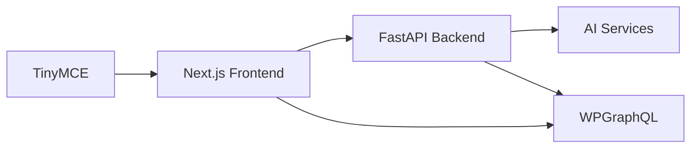

# Transcript to WP

A web application that converts YouTube transcripts into professional blog posts and publishes them directly to WordPress, powered by AI.

## Features

- **YouTube Integration**: Automatically fetch transcripts from YouTube videos
- **AI Processing**: Convert transcripts into various formats using multiple AI models:
  - GPT-4
  - Gemini
  - DeepSeek
  - Llama 3
- **Multiple Output Formats**:
  - Blog Posts
  - Step-by-Step Guides
  - Summaries
  - Educational Materials
- **WordPress Integration**:
  - Multiple account management
  - Post scheduling
  - Draft/publish control
  - Categories and tags support
  - Featured image support
- **Content Management**:
  - Template system
  - Post management interface
  - Bulk actions
  - Search and filtering

## Setup

1. Clone the repository:
```bash
git clone https://github.com/yourusername/Transcript-to-WP.git
cd Transcript-to-WP
```

2. Create and activate a virtual environment:

For Windows:
```bash
python -m venv venv
.\venv\Scripts\activate
```

For macOS/Linux:
```bash
python3 -m venv venv
source venv/bin/activate
```

3. Install Python dependencies:
```bash
pip install -r requirements.txt
```

4. Create a `.env` file in the root directory with your API keys:
```env
OPENAI_API_KEY=your_openai_key_here
GEMINI_API_KEY=your_gemini_key_here
GROQ_API_KEY=your_groq_key_here
```

5. Start the servers:
- Backend: `python server.py` (runs on port 5000)
- Frontend: `python -m http.server 8000`

6. Access the application at `http://localhost:8000`

## WordPress Setup

1. In your WordPress site:
   - Go to Users → Profile
   - Scroll to Application Passwords
   - Add new application password
   - Copy the generated password

2. In the application:
   - Click "Manage WP Accounts"
   - Add your WordPress site URL
   - Enter your username
   - Enter the application password
   - (Optional) Add to a folder for organization

## Usage

1. Enter a YouTube URL
2. Select desired format:
   - Blog Post
   - Step-by-Step Guide
   - Summary
   - Educator Plus
3. Choose AI model
4. Generate content
5. Edit as needed in the rich text editor
6. Add title, categories, tags
7. Select WordPress account
8. Publish or schedule

## Project Structure

```
Transcript-to-WP/
├── server.py           # Flask backend server
├── ai_agent.py        # AI processing logic
├── requirements.txt   # Python dependencies
├── .env              # API keys (not in repo)
└── static/           # Frontend files
    ├── index.html
    ├── wordpress_management.html
    ├── wordpress_posts.html
    ├── sent_posts.html
    └── images/
```

## Security Notes

- Never commit your `.env` file
- Use application passwords for WordPress
- Store credentials securely
- Follow WordPress security best practices

## License

[Your chosen license]

## Contributing

Contributions are welcome! Please feel free to submit a Pull Request.

## Future Development Roadmap

### Proposed Architecture Improvements

#### Frontend Framework Migration (Next.js)
- State management
- Built-in routing
- Server-side rendering
- TypeScript support for type safety
- Enhanced error handling
- TinyMCE integration for WordPress compatibility
- Native WordPress blocks support
- Better image handling
- Built-in WordPress shortcodes support

#### Backend Enhancement (FastAPI)
- Native async support
- Automatic API documentation
- Improved error handling
- Type validation built-in
- Background task processing
- WebSocket support for real-time updates

#### WordPress Integration Enhancement
- Migration to WPGraphQL from REST API
- More efficient queries
- Better data typing
- Reduced API calls
- Enhanced error handling
- More secure authentication

#### Data Storage Improvement
- Migration from localStorage to SQLite/PostgreSQL
- More reliable data persistence
- Better query capabilities
- Proper backup support
- Transaction support
- Enhanced data relationships

### System Architecture



### Development Phases

1. **Phase 1: Core Setup**
   - FastAPI backend setup
   - Next.js frontend setup
   - Basic API integrations

2. **Phase 2: Content Processing**
   - YouTube transcript fetching
   - AI processing implementation
   - Real-time updates

3. **Phase 3: WordPress Integration**
   - WPGraphQL setup
   - Media handling
   - Post management

4. **Phase 4: UX Implementation**
   - TinyMCE integration
   - Progress indicators
   - Error handling

### Enhanced Features

#### Content Processing
```python
@app.post("/transcript")
async def process_transcript(
    video_url: str,
    format: str = "raw",
    model: str = "gpt-4o",
    background_tasks: BackgroundTasks
):
    """
    Enhanced transcript processing with:
    - Async processing for long transcripts
    - Progress updates
    - Format-specific optimization
    - Error handling per format
    """
    try:
        video_id = extract_video_id(video_url)
        transcript = await get_youtube_transcript(video_id)
        
        if format == "raw":
            return {"success": True, "transcript": transcript}
            
        result = await process_with_ai(
            transcript=transcript,
            format=format,
            model=model
        )
        
        return {
            "success": True,
            "transcript": result,
            "format": format,
            "model": model
        }
    except Exception as e:
        return {"success": False, "error": str(e)}
```

#### Model Configurations
```python
MODEL_CONFIGS = {
    "gpt-4o": {
        "max_tokens": 4000,
        "temperature": 0.7,
        "format_specific": {
            "blog_post": {"temperature": 0.8},
            "step_by_step_guide": {"temperature": 0.5},
            "summary": {"temperature": 0.3},
            "educator_plus": {"temperature": 0.6}
        }
    }
}
```

### Important Implementation Notes

1. **API Keys Management**
   - Maintain current .env structure
   - Add error handling for missing keys
   - Add key validation

2. **Local Storage Migration**
   - Maintain current WordPress account storage during migration
   - Add encryption for sensitive data
   - Implement better state management

3. **Content Processing**
   - Maintain all current AI processing options
   - Add queue system for large requests
   - Implement proper error recovery

4. **Testing Requirements**
   - API integration tests
   - Content processing validation
   - End-to-end testing

Note: This application remains a local-use tool without user authentication requirements.